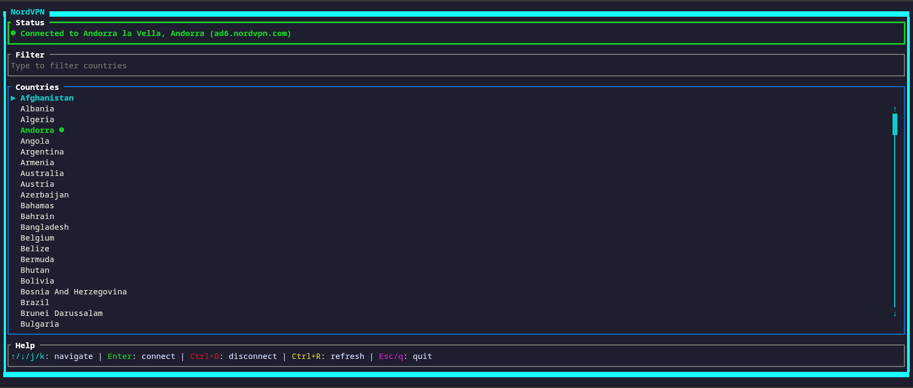

# nordvpn-tui

A terminal user interface for managing NordVPN connections. Requires the NordVPN CLI to be installed and running.



## Prerequisites

- NordVPN CLI installed and configured ([nordvpn.com/download/linux](https://nordvpn.com/download/linux/))
- NordVPN daemon running
- Logged in to NordVPN: `nordvpn login`

## Installation

### Install with Cargo

```bash
cargo install --git https://github.com/zhlyzv/nordvpn-tui.git
```

### Build from Source

```bash
git clone https://github.com/zhlyzv/nordvpn-tui.git
cd nordvpn-tui
cargo build --release
```

The binary will be at `target/release/nordvpn-tui`

### Install to System

After building:

```bash
sudo cp target/release/nordvpn-tui /usr/local/bin/
sudo chmod +x /usr/local/bin/nordvpn-tui
```

Or install with cargo:

```bash
cargo install --locked --path .
```

### Uninstall

```bash
cargo uninstall nordvpn-tui
# or
sudo rm /usr/local/bin/nordvpn-tui
```

## Usage

Run `nordvpn-tui`

## Troubleshooting

If the app fails to start, verify:
- NordVPN is installed: `which nordvpn`
- Daemon is running: `systemctl status nordvpnd`
- You're logged in: `nordvpn account`
